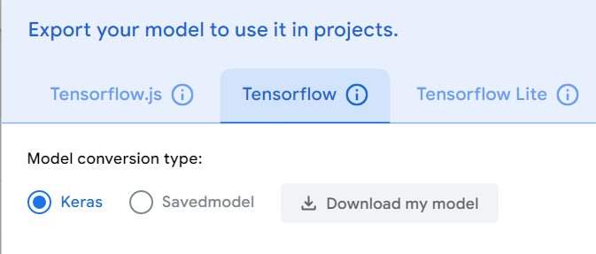
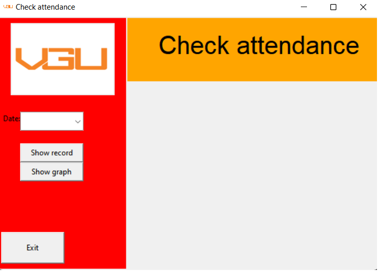
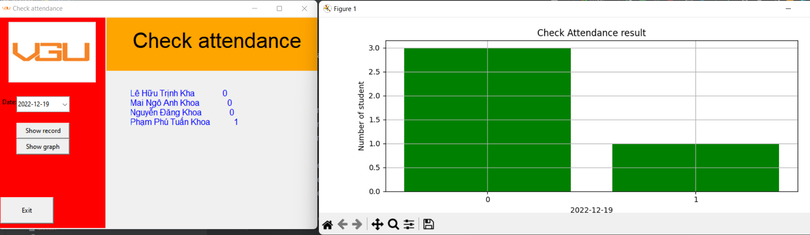

# **Check attendence system**

- [**Check attendence system**](#check-attendence-system)
  - [Tutorial](#tutorial)
    - [Requirement](#requirement)
    - [Process](#process)
      - [Step 1](#step-1)
      - [Step 2](#step-2)
      - [Step 3](#step-3)
  - [Contributor](#contact-us)
## Tutorial 
### Requirement 
1. Python 3.10 or higher
2. Install all library in this list :
- keras
- pillow
- opencv
- openpyxl
- datetime,time
- tkinter
- pandas
- matplotlib

### Process
#### Step 1 
Download our code from github
>git clone https://github.com/Garu01/check_attendence.git

#### Step 2
Upload image you want to train to [Google Teachable Machine](https://teachablemachine.withgoogle.com/) and train them, then download that model to your PC.

#### Step 3 
Run it and enjoy the show.
This is how the GUI looks like :

After a trained data stored in excel file, you can choose date to perform.
Click Show record to show all names with 0 or 1. 
0 means absent and 1 is opposite.
Click Show graph to show a bar graph. 
And this how it looks like :
 

## Contributor 
- [Đăng Khoa](https://www.facebook.com/seville.alvin)
- [Tuấn Khoa](https://www.facebook.com/phamphu.tuankhoa.1)
- [Huy Hoàng](https://www.facebook.com/huyhoang.nguyenmac)
- [Trịnh Kha](https://www.facebook.com/trinhkha03)
- [Anh Khoa](https://www.facebook.com/imkhoa.02)
- [Gia Bảo](https://www.facebook.com/lazy.giabao)

